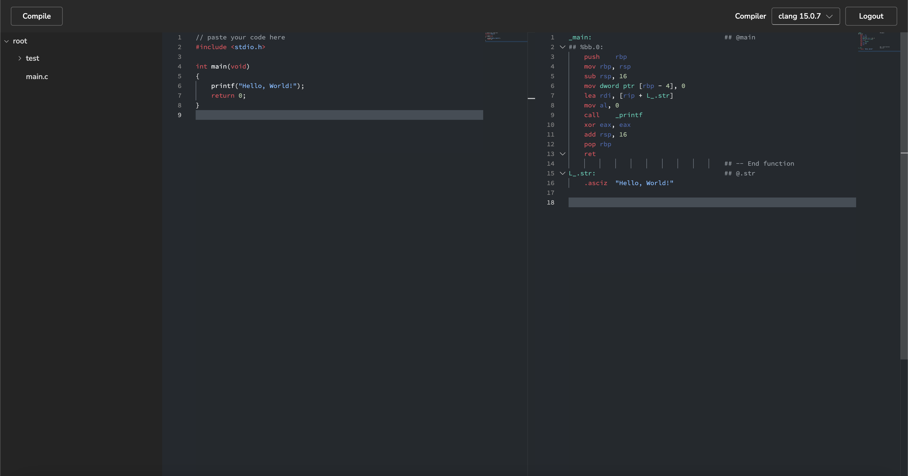

# Introspection 🔍

A fullstack compiler explorer web application tool that converts higher-level source code (e.g. C) to lower level representation (x86 assembly) using React with TypeScript on the frontend and a microservice architecture in the backend using Java, Go, and TypeScript.

Greatly influenced by [godbolt.org](https://godbolt.org).
